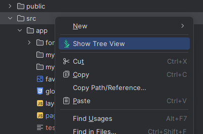
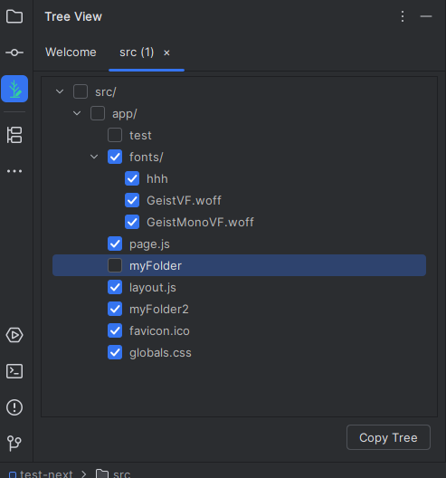

# JetTreeMark

  
[](https://github.com/HichemTab-tech/JetTreeMark/releases) [](https://github.com/HichemTab-tech/JetTreeMark/blob/main/LICENSE)

---

<!-- Plugin description -->
## 🚀 What is JetTreeMark?

**JetTreeMark** is an IntelliJ IDEA plugin that lets
you instantly generate and copy a **beautiful tree view** of any folder you select inside your project.  
Perfect for sharing your project structure, documentation, code reviews, or just showing off your clean organization.
😉

---

## ✨ Features

- 📂 Generate a clean tree view of any selected folder
- 📋 One-click copy to clipboard
- 🎨 Customize how the tree is displayed (coming soon)
- ⚡ Ultra lightweight and seamless integration with the IDE

---

## 📷 Example Output

```
└── folder/
    ├── subfolder1/
    │   └── file15
    ├── subfolder2/
    │   ├── file56
    │   └── file88
    ├── file10
    └── file11
```

---

<!-- Plugin description end -->

## 🛠️ Installation

> **Note:** JetTreeMark is not yet available on the JetBrains Marketplace. You can install it manually for now.

### Manual Installation

1. [Download the latest release](https://github.com/HichemTab-tech/JetTreeMark/releases/latest)
2. In IntelliJ IDEA, go to **Settings/Preferences → Plugins → ⚙️ → Install plugin from disk...**
3. Select the downloaded `.zip` file
4. Restart the IDE when prompted

---

### Building from Source

1. Clone the repository:
   ```bash
   git clone https://github.com/HichemTab-tech/JetTreeMark.git
   ```
2. Open it with IntelliJ IDEA
3. Run the build task:
   ```bash
   ./gradlew buildPlugin
   ```
4. Find your plugin zip inside `build/distributions/`
5. Install it manually as described above

---

## 🎯 How to Use

1. **Right-click** on any folder inside your Project tool window.
2. Select **"Show Tree View"** from the context menu.

   

3. A **JetTreeMark Tool Window** will open, showing the folder structure.
4. **Optionally**, select which files or folders you want to **exclude** from the final tree.

   

5. Click the **"Copy Tree"** button at the bottom to copy the tree view to your clipboard. 🚀

That's it! You can now paste your clean project structure anywhere you like.

---

## ℹ️ About

JetTreeMark is based on the [IntelliJ Platform Plugin Template][template].  
It follows the [JetBrains Plugin UX guidelines][docs:plugin-description]
to ensure a clean and smooth experience inside your IDE.

[template]: https://github.com/JetBrains/intellij-platform-plugin-template
[docs:plugin-description]: https://plugins.jetbrains.com/docs/intellij/plugin-user-experience.html#plugin-description-and-presentation

---

# 🌳 JetTreeMark — Draw your project structure, copy it instantly!